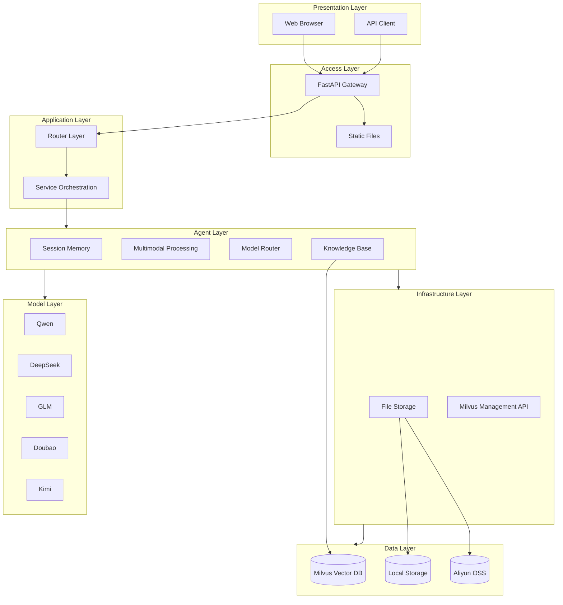
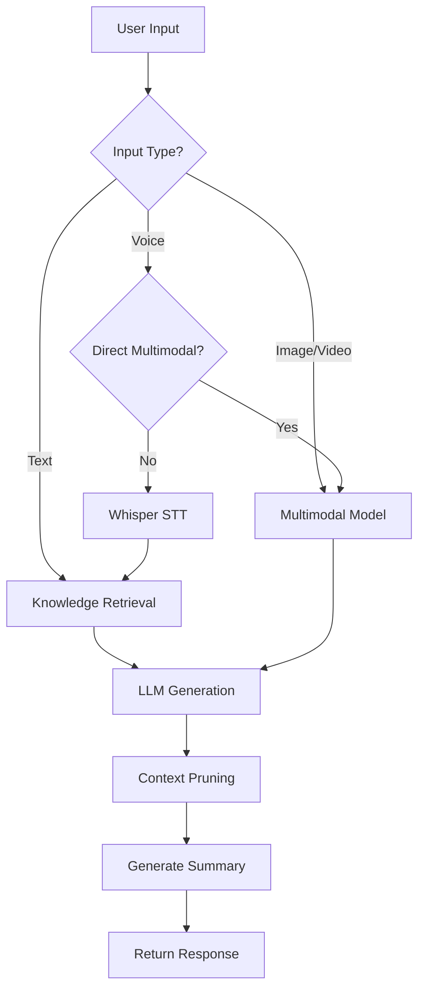

<h1>XiChuang <em>西窗</em></h1>

<p><sub>Your companion for late-night conversations</sub></p>

<p>


</p>

<br />

<br />

> **XiChuang** is a multimodal AI assistant, your companion for late-night conversations.

---

## Features

- **Multimodal Input**: Text, voice recording, image/audio/video file upload
- **Multi-Model Support**: Qwen (default), DeepSeek, GLM, Doubao, Kimi with dynamic switching
- **Smart Conversation**: Session memory, context pruning, auto summarization
- **Knowledge Retrieval**: RAG powered by Milvus
- **Data Management**: Milvus data query and management API

---

## System Architecture



---

## Core Flow

### Conversation Flow



---

## Tech Stack

### Backend

| Category | Technology | Version | Description |
|----------|------------|---------|-------------|
| Language | Python | 3.11 | Core development |
| Web Framework | FastAPI | - | Async API framework |
| ASGI Server | Uvicorn | - | Production server |
| LLM Orchestration | LangChain | - | LLM framework |
| Flow Orchestration | LangGraph | - | Conversation flow |
| Data Validation | Pydantic | v2 | Request/Response models |
| Audio Processing | pydub | - | Format conversion |
| Speech Recognition | Whisper | - | OpenAI STT |
| Vector Database | Milvus | - | Knowledge retrieval |

### Frontend

| Category | Technology | Version | Description |
|----------|------------|---------|-------------|
| Framework | Vue | 3.4 | Progressive JavaScript framework |
| Build Tool | Vite | 5.0 | Next-generation frontend tooling |
| Structure | HTML5 | - | Semantic tags |
| Styling | CSS3 | - | CSS variables + Flexbox responsive |
| Recording | MediaRecorder API | - | Browser recording |

### AI Models

| Category | Provider | Model Example | Usage |
|----------|----------|---------------|-------|
| Text Chat | Qwen | qwen-plus-latest | General conversation (default) |
| Multimodal | Qwen | qwen-vl-plus | Image/Audio/Video understanding |
| Text Chat | DeepSeek | deepseek-chat | General conversation |
| Text Chat | GLM | glm-4 | General conversation |
| Text Chat | Doubao | doubao-pro | General conversation |
| Text Chat | Kimi | moonshot-v1-8k | General conversation |
| Speech-to-Text | OpenAI | whisper-1 | ASR |
| Embedding | Qwen | text-embedding-v1 | Knowledge base |

---

## Project Structure

```
xichuang/
│
├── server/                      # Backend Service
│   ├── main.py                  # FastAPI Entry
│   │
│   ├── app/                     # Application Layer
│   │   ├── main.py              # App Factory
│   │   ├── routers/             # Router Layer
│   │   │   ├── chat.py          # Chat API
│   │   │   └── milvus.py        # Milvus Management API
│   │   └── services/            # Service Layer (Compatibility)
│   │
│   ├── agent/                   # Agent Module
│   │   ├── model_router.py      # Model Router
│   │   ├── multimodal.py        # Multimodal Processing
│   │   ├── memory.py            # Session Memory
│   │   ├── knowledge.py         # Knowledge Retrieval
│   │   └── media_models.py      # Media Data Models
│   │
│   ├── infra/                   # Infrastructure Layer
│   │   ├── storage.py           # File Storage (Local/OSS)
│   │   └── milvus.py     # Milvus Client
│   │
│   ├── statics/                 # Static Resources
│   │   ├── images/              # Image Files
│   │   ├── audio/               # Audio Files
│   │   ├── videos/              # Video Files (including recordings)
│   │   └── files/               # Other Files
│   │
│   ├── config/                  # Configuration Layer
│   │   └── settings.py          # Environment Config
│   │
│   ├── core/                    # Core Layer
│   │   └── logger.py            # Logging Wrapper
│   │
│   └── utils/                   # Utility Layer
│
├── web/                         # Frontend (Vue3)
│   ├── index.html               # Vite Entry
│   ├── package.json             # Frontend Dependencies
│   ├── vite.config.js           # Vite Config
│   └── src/
│       ├── main.js              # Vue Entry
│       ├── App.vue              # Root Component
│       ├── components/          # Components
│       │   ├── Sidebar.vue          # Sidebar
│       │   ├── ChatPanel.vue        # Chat Panel
│       │   ├── MessageList.vue      # Message List
│       │   ├── MessageItem.vue      # Message Item
│       │   └── InputArea.vue        # Input Area
│       ├── composables/         # Composables
│       │   ├── useChat.js           # Chat Logic
│       │   └── useRecorder.js       # Recording Logic
│       ├── services/            # Services
│       │   └── api.js               # API Client
│       └── styles/              # Styles
│           └── variables.css        # CSS Variables
│
├── data/                        # Data Directory
│   └── knowledge/               # Knowledge Documents
│
├── .env.example                 # Environment Variables Example
├── pyproject.toml               # Project Configuration
└── README.md                    # Documentation
```

---

## Quick Start

### 1. Install Dependencies

**Backend Dependencies**

```bash
pip install uv
uv venv
.venv\Scripts\activate  # Windows
uv sync
```

**Frontend Dependencies**

```bash
cd web
npm install
```

### 2. Configure Environment

```bash
cp .env.example .env
```

Edit `.env` and configure at least one model:

```bash
# Qwen (Recommended, default)
ALIYUN_API_KEY=your-api-key
ALIYUN_MODEL_NAME=qwen-plus-latest

# DeepSeek
DEEPSEEK_API_KEY=your-api-key

# GLM
GLM_API_KEY=your-api-key

# Doubao
DOUBAO_API_KEY=your-api-key
DOUBAO_MODEL_NAME=your-model-id

# Kimi
KIMI_API_KEY=your-api-key

# Aliyun OSS (optional)
ALIYUN_OSS_ACCESS_KEY_ID=your-access-key-id
ALIYUN_OSS_ACCESS_KEY_SECRET=your-access-key-secret
ALIYUN_OSS_ENDPOINT=oss-cn-hangzhou.aliyuncs.com
ALIYUN_OSS_BUCKET_NAME=your-bucket-name
```

### 3. Start Service

**Development Mode**

```bash
# Terminal 1: Start backend
cd server
uv run uvicorn app.main:app --reload --host 0.0.0.0 --port 8000

# Terminal 2: Start frontend dev server
cd web
npm run dev
```

Frontend dev server: http://localhost:5173

**Production Mode**

```bash
# Build frontend
cd web
npm run build

# Start backend (serves built frontend)
cd server
uv run uvicorn app.main:app --reload --host 0.0.0.0 --port 8000
```

Visit http://localhost:8000

---

## API Documentation

### Chat Endpoints

**Send Message**

```bash
POST /api/chat/message
Content-Type: application/json

{
  "session_id": "test",
  "query": "Hello",
  "provider": "tongyi"
}
```

**Upload File**

```bash
POST /api/chat/upload
Content-Type: multipart/form-data

session_id: test
query: Describe this image
media_type: image
file: [file]
```

**Get Available Providers**

```bash
GET /api/chat/providers

Response:
{
  "providers": [
    {"name": "tongyi", "display_name": "Qwen", "available": true},
    {"name": "deepseek", "display_name": "DeepSeek", "available": true}
  ],
  "default": "tongyi"
}
```

### Milvus Management Endpoints

**Get Statistics**

```bash
GET /api/milvus/stats
```

**List Collections**

```bash
GET /api/milvus/collections
```

**Search Data**

```bash
POST /api/milvus/search
Content-Type: application/json

{
  "collection_name": "x_multimodal_knowledge",
  "query_text": "search content",
  "top_k": 10
}
```

**Knowledge base diagnostics & rebuild (recommended)**

| Endpoint | Description |
|----------|-------------|
| `GET /api/milvus/knowledge-status` | Whether README is read, embedding key configured, last build error, etc. |
| `POST /api/milvus/rebuild-knowledge` | Force vectorize `README.md` and `data/knowledge/**/*.md` into Milvus (may be slow) |

---

## Operations & Known Limitations

Short notes for deployment and troubleshooting (no large architecture changes).

### Milvus / knowledge base (RAG)

- **Connecting to Milvus alone does not create collections**: collection `x_multimodal_knowledge` appears only after a **successful knowledge ingest**; calling `GET /api/milvus/collections` alone does not build it.
- **What gets indexed**: root `README.md` and all `.md` under `data/knowledge/`. **Web chat history is not auto-indexed** (separate from conversation MySQL).
- **Qwen embeddings**: input length is capped; the backend chunks text before write. If errors persist, check `last_build_error` from `knowledge-status`.
- **Keys**: vectorization needs **`ALIYUN_API_KEY`** (or compatible **`DASHSCOPE_API_KEY`** per `settings`); **restart the server** after changing `.env`.
- **Repeated rebuilds**: current logic uses `drop_old=False`; multiple `rebuild-knowledge` runs may accumulate duplicate chunks. For a clean slate, delete the collection via Milvus management APIs then rebuild.

### Frontend / sessions

- **Model vs DB**: each conversation’s `model_provider` is stored in MySQL and synced with the dropdown; `localStorage` only affects the **default for new** conversations.
- **First load**: the app loads the **selected** conversation’s detail for messages; empty sessions clear the list to avoid cross-session mix-ups.

### Backend / security

- **CORS**: `allow_origins=["*"]` with **`allow_credentials=False`** matches browser rules for wildcard + credentials; for production cookies, use an explicit origin list and enable credentials as needed.
- **Secrets**: do not commit `server/.env`; use env vars or a secret manager in production.

---

## Usage

### Web Interface

| Feature | Operation |
|---------|-----------|
| Text Chat | Type in input box, click send |
| Voice Recording | Click record button → Speak → Click again to stop |
| File Upload | Click attachment icon → Select file → Enter prompt → Send |
| Switch Model | Click model dropdown in top right corner |

### Media Type Selection

When uploading files, you can select from these types:
- **Auto**: Auto-detect by file extension
- **Text**: Text files
- **Voice**: Recording files
- **Image**: Image files
- **Video**: Video files

---

## Model Configuration

| Provider | Environment Variable | Model Example | Notes |
|----------|---------------------|---------------|-------|
| Qwen | `ALIYUN_API_KEY` | qwen-plus-latest | Default, recommended |
| DeepSeek | `DEEPSEEK_API_KEY` | deepseek-chat | Cost-effective |
| GLM | `GLM_API_KEY` | glm-4 | Zhipu AI |
| Doubao | `DOUBAO_API_KEY` | Model ID required | Volcano Engine |
| Kimi | `KIMI_API_KEY` | moonshot-v1-8k | Moonshot AI |

---

## Storage Configuration

### Local Storage (Default)

Files are saved in `server/statics/` directory:
- `images/` - Images
- `audio/` - Audio
- `videos/` - Videos and recordings
- `files/` - Other files

### Aliyun OSS

Configure these environment variables to enable:

```bash
STORAGE_TYPE=oss
ALIYUN_OSS_ACCESS_KEY_ID=your-key
ALIYUN_OSS_ACCESS_KEY_SECRET=your-secret
ALIYUN_OSS_ENDPOINT=oss-cn-hangzhou.aliyuncs.com
ALIYUN_OSS_BUCKET_NAME=your-bucket
```

---

## FAQ

| Issue | Solution |
|-------|----------|
| Missing dependencies | Run `uv sync` and activate virtual environment |
| No response in conversation | Check API Key configuration in `.env` |
| Speech-to-text fails | Configure `OPENAI_API_KEY` or use multimodal model |
| Milvus collection list always empty | Configure Qwen key then `POST /api/milvus/rebuild-knowledge`, or `GET /api/milvus/knowledge-status` for cause |
| RAG returns no hits | Ensure collection exists and README/knowledge md have content; chat is not indexed by default |
| Knowledge retrieval fails | Check Milvus is up and `MILVUS_HOST` / `MILVUS_PORT` are correct |
| Model switch ineffective | Confirm API keys; per-conversation model follows DB `model_provider` |

---

## License

MIT
