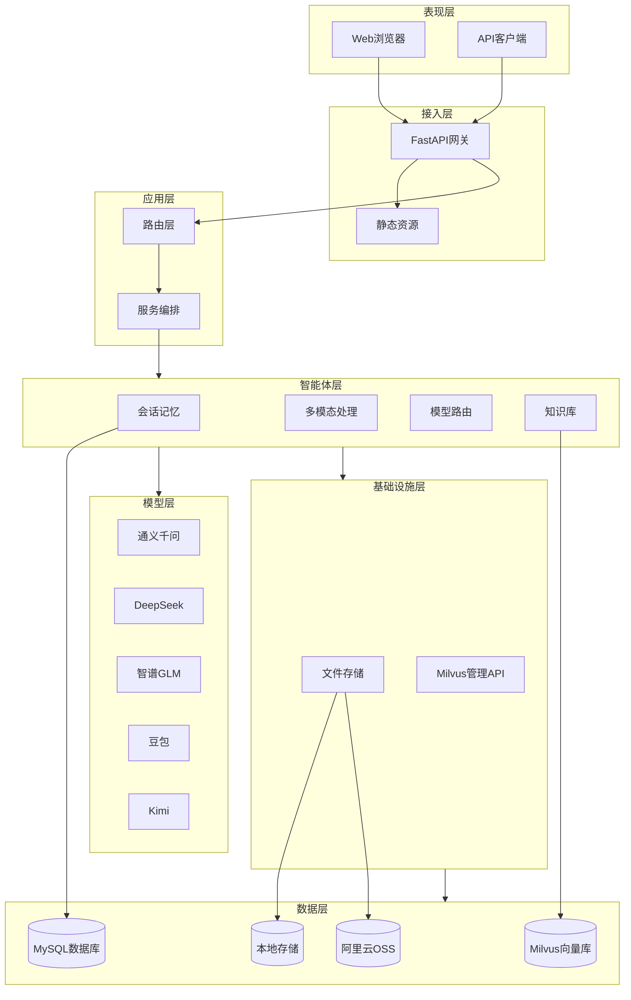
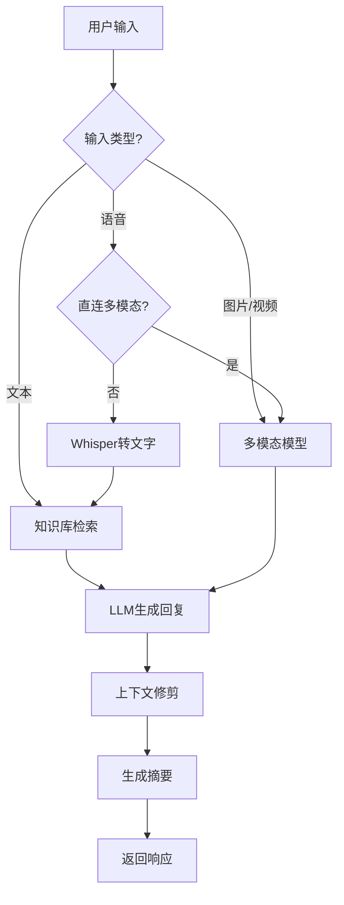

<h1>西窗 <em>XiChuang</em></h1>

> 在西窗下，与你对话

<p>


</p>

---

## 项目简介

**西窗（XiChuang）** 是一款生产级多模态智能交互助手，基于 LangChain + LangGraph + FastAPI 构建现代化 AI 对话系统。

- **项目定位**：企业级多模态 AI 助手解决方案，支持文本、语音、图片、视频等多种交互方式
- **核心价值**：开箱即用的多模型切换、智能会话记忆、RAG 知识库检索，无需从零搭建
- **适用场景**：智能客服、企业知识库问答、多模态内容理解、语音交互系统

---

## 核心特征

- **多模态输入** - 支持文本对话、语音录制、图片/音频/视频文件上传
- **多模型支持** - 内置千问、DeepSeek、GLM、豆包、Kimi 等主流模型，支持动态切换
- **智能对话** - 会话记忆持久化、上下文自动修剪、长对话自动摘要
- **知识库检索** - 基于 Milvus 的 RAG 检索增强，支持文档向量化与语义搜索
- **数据管理** - 提供 Milvus 数据查询、状态诊断、知识库重建 API
- **生产就绪** - Docker Compose 一键部署，MySQL 会话持久化，OSS 云存储支持

---

## 项目结构

```
xichuang/
│
├── server/                          # 后端服务
│   ├── src/                         # 源代码目录
│   │   ├── main.py                  # FastAPI 入口
│   │   ├── app/                     # 应用层
│   │   │   ├── main.py              # 应用工厂
│   │   │   ├── routers/             # 路由层
│   │   │   │   ├── chat.py          # 聊天 API
│   │   │   │   ├── conversations.py # 会话管理 API
│   │   │   │   └── milvus.py        # Milvus 管理 API
│   │   │   └── services/            # 服务层
│   │   │       ├── chat_service.py  # 聊天服务
│   │   │       └── milvus_service.py# Milvus 服务
│   │   │
│   │   ├── agent/                   # 智能体模块
│   │   │   ├── model.py             # 模型路由
│   │   │   ├── multimodal.py        # 多模态处理
│   │   │   ├── memory.py            # 会话记忆
│   │   │   ├── knowledge.py         # 知识库检索
│   │   │   └── media.py             # 媒体数据处理
│   │   │
│   │   ├── infra/                   # 基础设施层
│   │   │   ├── storage.py           # 文件存储（本地/OSS）
│   │   │   ├── milvus.py            # Milvus 连接
│   │   │   └── mysql/               # MySQL 数据库
│   │   │       ├── mysql.py         # 数据库连接
│   │   │       └── models.py        # ORM 模型
│   │   │
│   │   ├── config/                  # 配置层
│   │   │   └── settings.py          # 环境配置
│   │   │
│   │   ├── core/                    # 核心层
│   │   │   └── logger.py            # 日志封装
│   │   │
│   │   └── utils/                   # 工具层
│   │       ├── file_util.py         # 文件工具
│   │       ├── text_util.py         # 文本工具
│   │       └── ...                  # 其他工具
│   │
│   ├── statics/                     # 静态资源目录
│   │   ├── images/                  # 图片文件
│   │   ├── audio/                   # 音频文件
│   │   ├── videos/                  # 视频文件
│   │   └── files/                   # 其他文件
│   │
│   ├── tests/                       # 测试目录
│   ├── logs/                        # 日志目录
│   ├── .env                         # 环境变量配置
│   ├── .env.example                 # 环境变量示例
│   └── pyproject.toml               # 项目配置
│
├── web/                             # 前端页面（Vue3）
│   ├── index.html                   # Vite 入口
│   ├── package.json                 # 前端依赖
│   ├── vite.config.js               # Vite 配置
│   └── src/
│       ├── main.js                  # Vue 入口
│       ├── App.vue                  # 根组件
│       ├── components/              # 组件
│       │   ├── Sidebar.vue          # 侧边栏
│       │   ├── ChatPanel.vue        # 聊天面板
│       │   ├── MessageList.vue      # 消息列表
│       │   ├── MessageItem.vue      # 消息项
│       │   └── InputArea.vue        # 输入区域
│       ├── composables/             # 组合式函数
│       │   ├── useChat.js           # 聊天逻辑
│       │   └── useRecorder.js       # 录音逻辑
│       ├── services/                # 服务
│       │   └── api.js               # API 客户端
│       └── styles/                  # 样式
│           └── variables.css        # CSS 变量
│
├── data/                            # 数据目录
│   └── knowledge/                   # 知识库文档
│
├── scripts/                         # 脚本目录
│   └── mysql-init/                  # MySQL 初始化脚本
│
├── docker-compose.yml               # Docker Compose 配置
├── Dockerfile                       # Docker 镜像构建
├── LICENSE                          # 许可证
└── README.md                        # 项目文档
```

---

## 系统架构

### 系统分层架构



### 核心业务流程



---

## 快速开始

### 环境要求

| 环境 | 要求 |
|------|------|
| **Windows** | Python 3.11、Node.js 18+、MySQL 8.0（可选）、Milvus（可选） |
| **Linux** | Python 3.11、Node.js 18+、MySQL 8.0（可选）、Milvus（可选） |
| **Docker** | Docker 20.10+、Docker Compose 2.0+ |

### 项目克隆

```bash
git clone https://gitee.com/chain-engine/x-XiChuang.git
cd x-XiChuang
```

### 依赖安装

**后端依赖（使用 uv）**

```bash
# 安装 uv
pip install uv

# 创建虚拟环境并安装依赖
cd server
uv venv

# 激活虚拟环境
# Windows:
.venv\Scripts\activate
# Linux/macOS:
source .venv/bin/activate

# 同步依赖
uv sync
```

**前端依赖**

```bash
cd web
npm install
```

### 配置文件创建

```bash
# 复制环境变量模板
cp server/.env.example server/.env
```

编辑 `server/.env`，配置至少一个模型 API Key：

| 配置项 | 说明 | 必填 |
|--------|------|------|
| `ALIYUN_API_KEY` | 阿里云千问 API Key | 推荐 |
| `DEEPSEEK_API_KEY` | DeepSeek API Key | 可选 |
| `GLM_API_KEY` | 智谱 GLM API Key | 可选 |
| `DOUBAO_API_KEY` | 火山豆包 API Key | 可选 |
| `KIMI_API_KEY` | Kimi API Key | 可选 |
| `OPENAI_API_KEY` | OpenAI API Key（语音转文字） | 可选 |
| `MYSQL_HOST` | MySQL 主机地址 | Docker 必填 |
| `MYSQL_PASSWORD` | MySQL 密码 | Docker 必填 |
| `MILVUS_HOST` | Milvus 主机地址 | 可选 |

### 服务启动

#### 方式一：Docker 部署（推荐）

```bash
# 1. 配置环境变量
cp server/.env.example .env
# 编辑 .env 文件，配置 API Key

# 2. 启动所有服务（MySQL + Milvus + 应用）
docker-compose up -d

# 3. 查看日志
docker-compose logs -f app

# 4. 访问应用
# 前端界面：http://localhost:8000
# API 文档：http://localhost:8000/docs
```

#### 方式二：本地开发启动

```bash
# 终端 1：启动后端
cd server
uv run uvicorn src.app.main:app --reload --host 0.0.0.0 --port 8000

# 终端 2：启动前端开发服务器
cd web
npm run dev
```

访问地址：
- 前端开发服务器：http://localhost:5173
- 后端 API：http://localhost:8000
- API 文档：http://localhost:8000/docs

### 常用命令

```bash
# 运行测试
cd server
uv run pytest

# 代码格式化
uv run ruff format .

# 代码检查
uv run ruff check .

# 类型检查
uv run mypy .
```

---

## 技术栈

### 后端技术

| 类别 | 技术 | 版本 | 说明 |
|------|------|------|------|
| 编程语言 | Python | 3.11 | 核心开发语言 |
| Web 框架 | FastAPI | 0.111+ | 高性能异步 API |
| ASGI 服务器 | Uvicorn | - | 生产级服务器 |
| LLM 编排 | LangChain | 0.3+ | 大模型框架 |
| 流程编排 | LangGraph | 0.1+ | 对话流程图 |
| 数据校验 | Pydantic | v2 | 请求/响应模型 |
| 音频处理 | pydub | - | 格式转换 |
| 语音识别 | Whisper | - | OpenAI STT |
| 向量数据库 | Milvus | - | 知识库检索 |
| 关系数据库 | MySQL | 8.0 | 会话持久化 |
| ORM | SQLAlchemy | 2.0 | 数据库操作 |

### 前端技术

| 类别 | 技术 | 版本 | 说明 |
|------|------|------|------|
| 框架 | Vue | 3.4 | 渐进式 JavaScript 框架 |
| 构建工具 | Vite | 5.0 | 下一代前端构建工具 |
| 页面结构 | HTML5 | - | 语义化标签 |
| 样式 | CSS3 | - | CSS 变量 + Flexbox 响应式 |
| 录音 | MediaRecorder API | - | 浏览器录音 |

### AI 模型

| 类别 | 提供商 | 模型示例 | 用途 |
|------|--------|----------|------|
| 文本对话 | 千问 | qwen-plus-latest | 通用对话（默认） |
| 多模态 | 千问 | qwen-vl-plus | 图/音/视频理解 |
| 文本对话 | DeepSeek | deepseek-chat | 通用对话 |
| 文本对话 | GLM | glm-4 | 通用对话 |
| 文本对话 | 豆包 | doubao-pro | 通用对话 |
| 文本对话 | Kimi | moonshot-v1-8k | 通用对话 |
| 语音转文字 | OpenAI | whisper-1 | ASR |
| 向量嵌入 | 千问 | text-embedding-v1 | 知识库 |

### 部署工具

| 类别 | 技术 | 说明 |
|------|------|------|
| 容器化 | Docker | 应用容器化 |
| 编排 | Docker Compose | 多服务编排 |
| 存储 | 阿里云 OSS | 云存储（可选） |

---

## 模型配置

| 提供商 | 环境变量 | 模型示例 | 说明 |
|--------|----------|----------|------|
| 千问 | `ALIYUN_API_KEY` | qwen-plus-latest | 默认推荐 |
| DeepSeek | `DEEPSEEK_API_KEY` | deepseek-chat | 性价比高 |
| GLM | `GLM_API_KEY` | glm-4 | 智谱AI |
| 豆包 | `DOUBAO_API_KEY` | 需配置模型ID | 火山引擎 |
| Kimi | `KIMI_API_KEY` | moonshot-v1-8k | 月之暗面 |

详细配置参考 [server/.env.example](server/.env.example)

---

## API 文档

### Swagger 交互式文档

启动后端服务后，可通过以下地址访问 API 文档：

| 文档类型 | 地址 | 说明 |
|----------|------|------|
| Swagger UI | http://localhost:8000/docs | 交互式 API 文档，可直接测试接口 |
| ReDoc | http://localhost:8000/redoc | 只读 API 文档，更美观 |
| OpenAPI JSON | http://localhost:8000/openapi.json | OpenAPI Schema |

### 聊天接口

**发送消息**

```bash
POST /api/chat/message
Content-Type: application/json

{
  "session_id": "test",
  "query": "你好",
  "provider": "tongyi"
}
```

**上传文件**

```bash
POST /api/chat/upload
Content-Type: multipart/form-data

session_id: test
query: 描述这个图片
media_type: image
file: [文件]
```

**获取可用模型**

```bash
GET /api/chat/providers

Response:
{
  "providers": [
    {"name": "tongyi", "display_name": "千问", "available": true},
    {"name": "deepseek", "display_name": "DeepSeek", "available": true}
  ],
  "default": "tongyi"
}
```

### Milvus 管理接口

| 接口 | 方法 | 说明 |
|------|------|------|
| `/api/milvus/stats` | GET | 获取统计信息 |
| `/api/milvus/collections` | GET | 列出集合 |
| `/api/milvus/search` | POST | 查询数据 |
| `/api/milvus/knowledge-status` | GET | 知识库诊断 |
| `/api/milvus/rebuild-knowledge` | POST | 重建知识库 |

---

## 存储配置

### 本地存储（默认）

文件保存在 `server/statics/` 目录下：

- `images/` - 图片
- `audio/` - 音频
- `videos/` - 视频和录音
- `files/` - 其他文件

### 阿里云 OSS

配置以下环境变量启用：

```bash
STORAGE_TYPE=oss
ALIYUN_OSS_ACCESS_KEY_ID=your-key
ALIYUN_OSS_ACCESS_KEY_SECRET=your-secret
ALIYUN_OSS_ENDPOINT=oss-cn-hangzhou.aliyuncs.com
ALIYUN_OSS_BUCKET_NAME=your-bucket
```

---

## 常见问题

| 问题 | 解决方案 |
|------|----------|
| 依赖缺失 | 执行 `uv sync` 并激活虚拟环境 |
| 对话无响应 | 检查 `.env` 中 API Key 配置 |
| 语音转文字失败 | 配置 `OPENAI_API_KEY` 或使用多模态模型 |
| Milvus 列表为空 | 配置通义 Key 后调用 `POST /api/milvus/rebuild-knowledge` |
| 知识库检索无结果 | 确认 Milvus 已存在集合、README/知识库 md 有内容 |
| 模型切换无效 | 确认对应模型的 API Key 已配置 |

---

## 许可证

本项目采用 [MIT License](LICENSE) 开源协议。

---

## 参考资料

- [FastAPI 官方文档](https://fastapi.tiangolo.com/)
- [Python 官方文档](https://docs.python.org/3.11/)
- [uv 官方文档](https://docs.astral.sh/uv/)
- [LangChain 官方文档](https://python.langchain.com/)
- [LangGraph 官方文档](https://langchain-ai.github.io/langgraph/)
- [Vue 3 官方文档](https://vuejs.org/)
- [Milvus 官方文档](https://milvus.io/docs)

---

## 联系方式

**作者**：John Young  
**邮箱**：john.young@foxmail.com
