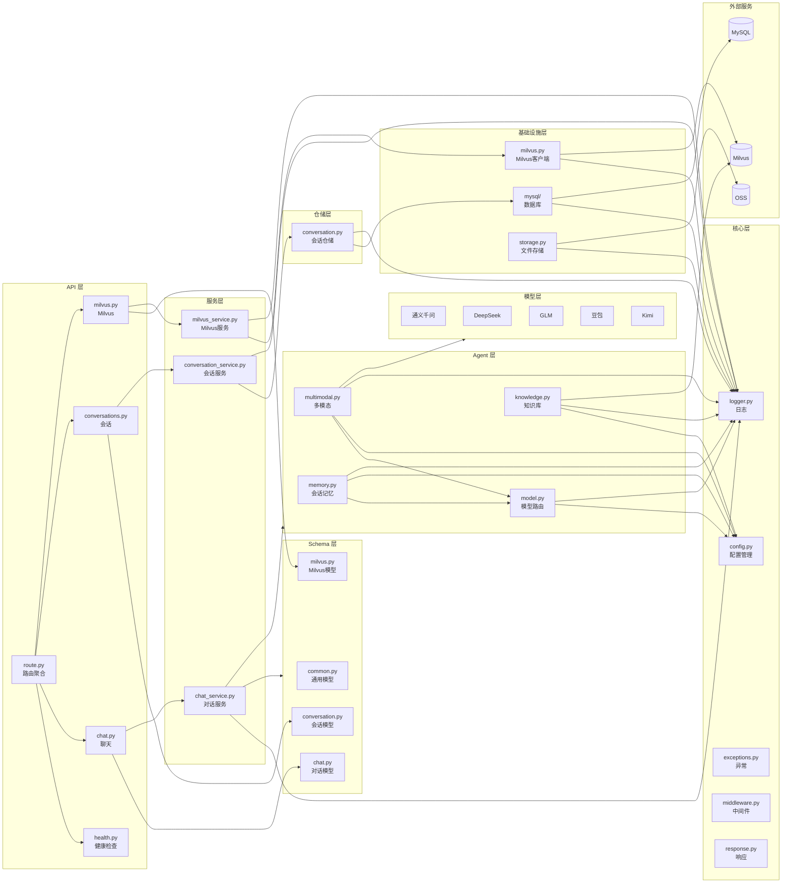
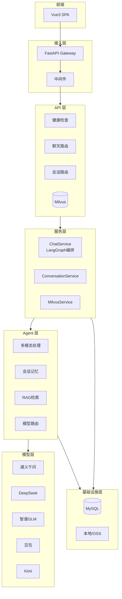
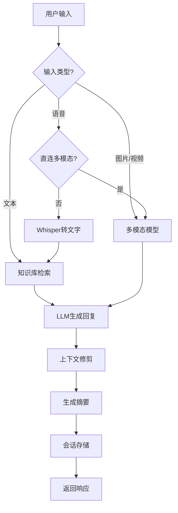

# 西窗 XiChuang

> 在西窗下，与你对话

<p>


</p>

---

## 项目简介

**西窗（XiChuang）** 是一款基于 LangChain + LangGraph + FastAPI 构建的多模态智能交互助手。

- **项目定位**：企业级多模态 AI 助手解决方案，支持文本、语音、图片、视频等多种交互方式
- **核心价值**：开箱即用的多模型切换、智能会话记忆、RAG 知识库检索，无需从零搭建
- **适用场景**：智能客服、企业知识库问答、多模态内容理解、语音交互系统

---

## 核心特征

- **多模态输入** - 支持文本对话、语音录制、图片/音频/视频文件上传
- **多模型支持** - 内置千问、DeepSeek、GLM、豆包、Kimi 等主流模型，支持动态切换
- **LangGraph 编排** - 基于状态图的对话流程：检索 → 生成 → 摘要
- **智能对话** - 会话记忆持久化、上下文自动修剪、滚动摘要生成
- **知识库检索** - 基于 Milvus 的 RAG 检索增强，支持文档向量化与语义搜索
- **数据管理** - 提供 Milvus 数据查询、状态诊断，知识库重建 API
- **存储灵活** - 本地存储或阿里云 OSS 云存储
- **Docker 部署** - Docker Compose 一键部署 MySQL + Milvus + 应用

---

## 项目结构

```
x-XiChuang/
│
├── server/                         # 后端服务
│   ├── src/                        # 源代码目录
│   │   ├── main.py                # FastAPI 入口
│   │   │
│   │   ├── core/                  # 核心层
│   │   │   ├── config.py          # 配置管理
│   │   │   ├── logger.py          # 日志封装
│   │   │   ├── exceptions.py      # 异常定义
│   │   │   ├── middleware.py      # 中间件
│   │   │   └── response.py        # 统一响应
│   │   │
│   │   ├── constants/             # 常量层
│   │   │   ├── enums.py           # 业务枚举
│   │   │   └── codes.py           # 状态码
│   │   │
│   │   ├── schemas/               # Schema 层
│   │   │   ├── common.py          # 通用模型
│   │   │   ├── chat.py            # 对话模型
│   │   │   ├── conversation.py   # 会话模型
│   │   │   └── milvus.py          # Milvus 模型
│   │   │
│   │   ├── repositories/          # 数据访问层
│   │   │   ├── base.py            # 仓储基类
│   │   │   └── conversation.py    # 会话仓储
│   │   │
│   │   ├── services/              # 业务逻辑层
│   │   │   ├── chat_service.py    # 对话服务
│   │   │   ├── conversation_service.py
│   │   │   └── milvus_service.py
│   │   │
│   │   ├── api/                   # API 路由层
│   │   │   ├── route.py           # 路由聚合
│   │   │   └── v1/
│   │   │       ├── health.py      # 健康检查
│   │   │       ├── chat.py        # 聊天 API
│   │   │       ├── conversations.py
│   │   │       └── milvus.py
│   │   │
│   │   ├── agent/                 # AI 智能体
│   │   │   ├── model.py           # 模型路由
│   │   │   ├── multimodal.py      # 多模态处理
│   │   │   ├── memory.py          # 会话记忆
│   │   │   └── knowledge.py       # 知识库检索
│   │   │
│   │   ├── infras/                # 基础设施
│   │   │   ├── milvus.py          # Milvus 客户端
│   │   │   ├── storage.py         # 文件存储
│   │   │   └── mysql/
│   │   │       ├── mysql.py       # 数据库连接
│   │   │       └── models.py      # ORM 模型
│   │   │
│   │   └── routes/                # 路由层（备用）
│   │       └── v1/...
│   │
│   ├── statics/                    # 静态资源
│   ├── tests/                      # 测试
│   ├── logs/                       # 日志
│   ├── .env.example               # 环境变量模板
│   └── pyproject.toml
│
├── web/                            # 前端（Vue3）
│   ├── index.html
│   ├── package.json
│   ├── vite.config.js
│   └── src/
│       ├── main.js
│       ├── App.vue
│       ├── components/
│       │   ├── ChatPanel.vue
│       │   ├── InputArea.vue
│       │   ├── MessageItem.vue
│       │   ├── MessageList.vue
│       │   └── Sidebar.vue
│       ├── composables/
│       │   ├── useChat.js
│       │   └── useRecorder.js
│       └── services/
│           └── api.js
│
├── data/                           # 数据目录
│   └── knowledge/                   # 知识库文档
│
├── scripts/                         # 脚本
│   └── mysql-init/                  # MySQL 初始化
│
├── docker-compose.yml               # Docker 编排
├── Dockerfile
├── LICENSE
└── README.md
```

---

## 系统架构

### 模块依赖图



### 架构分层



### 对话流程



---

## 快速开始

### 环境要求

| 环境 | 要求 |
|------|------|
| **Python** | 3.11+ |
| **Node.js** | 18+ |
| **MySQL** | 8.0+ (可选) |
| **Milvus** | 2.x (可选) |
| **Docker** | 20.10+ (可选) |

### 依赖安装

**后端依赖（使用 uv）**

```bash
# 安装 uv
pip install uv

# 创建虚拟环境并安装依赖
cd server
uv venv
source .venv/bin/activate  # Linux/macOS
# .venv\Scripts\activate   # Windows

# 同步依赖
uv sync
```

**前端依赖**

```bash
cd ../web
npm install
```

### 配置文件

```bash
# 复制环境变量模板
cp server/.env.example server/.env
```

编辑 `server/.env`，配置至少一个模型 API Key：

| 配置项 | 说明 | 必填 |
|--------|------|------|
| `ALIYUN_API_KEY` | 阿里云千问 API Key | 推荐 |
| `DEEPSEEK_API_KEY` | DeepSeek API Key | 可选 |
| `GLM_API_KEY` | 智谱 GLM API Key | 可选 |
| `DOUBAO_API_KEY` | 火山豆包 API Key | 可选 |
| `KIMI_API_KEY` | Kimi API Key | 可选 |
| `OPENAI_API_KEY` | OpenAI API Key（Whisper） | 可选 |
| `MYSQL_*` | MySQL 连接配置 | Docker 必填 |
| `MILVUS_*` | Milvus 连接配置 | 可选 |

### 服务启动

#### 方式一：Docker 部署（推荐）

```bash
# 1. 配置环境变量
cp server/.env.example .env
# 编辑 .env 文件

# 2. 启动所有服务
docker-compose up -d

# 3. 查看日志
docker-compose logs -f app

# 4. 访问应用
# 前端：http://localhost:8000
# API 文档：http://localhost:8000/docs
```

#### 方式二：本地开发

```bash
# 终端 1：后端
cd server
uv run uvicorn src.main:app --reload --host 0.0.0.0 --port 8000

# 终端 2：前端
cd web
npm run dev
```

### 常用命令

```bash
cd server

# 运行测试
uv run pytest

# 代码格式化
uv run ruff format .

# 代码检查
uv run ruff check .

# 类型检查
uv run mypy .
```

---

## 技术栈

### 后端技术

| 类别 | 技术 | 版本 | 说明 |
|------|------|------|------|
| 语言 | Python | 3.11 | 核心开发语言 |
| 框架 | FastAPI | 0.111+ | 高性能异步 API |
| 服务器 | Uvicorn | - | ASGI 服务器 |
| LLM 编排 | LangChain | 0.3+ | 大模型框架 |
| 流程编排 | LangGraph | 0.1+ | 状态图编排 |
| 数据校验 | Pydantic | v2 | 请求/响应模型 |
| 音频处理 | pydub | - | 格式转换 |
| 语音识别 | Whisper | - | OpenAI STT |
| 向量数据库 | Milvus | - | 知识库检索 |
| 关系数据库 | MySQL | 8.0 | 会话持久化 |
| ORM | SQLAlchemy | 2.0 | 数据库操作 |

### 前端技术

| 类别 | 技术 | 版本 | 说明 |
|------|------|------|------|
| 框架 | Vue | 3.4 | 渐进式 JavaScript 框架 |
| 构建 | Vite | 5.0 | 下一代前端构建工具 |
| Markdown | marked | 12.0 | 消息渲染 |
| 代码高亮 | highlight.js | 11.10 | 代码块渲染 |
| 录音 | MediaRecorder | - | 浏览器录音 API |

### AI 模型

| 类别 | 提供商 | 模型 | 用途 |
|------|--------|------|------|
| 文本对话 | 千问 | qwen-plus | 通用对话（默认） |
| 多模态 | 千问 | qwen-vl-plus | 图片/视频理解 |
| 文本对话 | DeepSeek | deepseek-chat | 通用对话 |
| 文本对话 | GLM | glm-4 | 通用对话 |
| 文本对话 | 豆包 | doubao-pro | 通用对话 |
| 文本对话 | Kimi | moonshot-v1-8k | 通用对话 |
| 语音转文字 | OpenAI | whisper-1 | ASR |
| 向量嵌入 | 千问 | text-embedding-v1 | 知识库 |

---

## API 文档

### 交互式文档

启动后端后访问：

| 文档 | 地址 |
|------|------|
| Swagger UI | http://localhost:8000/docs |
| ReDoc | http://localhost:8000/redoc |
| OpenAPI JSON | http://localhost:8000/openapi.json |

### 核心接口

| 接口 | 方法 | 说明 |
|------|------|------|
| `/api/health` | GET | 健康检查 |
| `/api/health/live` | GET | 存活探针 |
| `/api/health/ready` | GET | 就绪探针 |
| `/api/version` | GET | 版本信息 |
| `/api/chat/message` | POST | 标准对话 |
| `/api/chat/stream` | POST | 流式对话 |
| `/api/chat/upload` | POST | 文件上传对话 |
| `/api/chat/providers` | GET | 可用模型列表 |
| `/api/conversations` | GET/POST | 会话列表/创建 |
| `/api/conversations/{id}` | GET/PUT/DELETE | 会话操作 |
| `/api/milvus/stats` | GET | Milvus 统计 |
| `/api/milvus/collections` | GET | 集合列表 |
| `/api/milvus/search` | POST | 向量搜索 |
| `/api/milvus/rebuild-knowledge` | POST | 重建知识库 |

---

## 存储配置

### 本地存储（默认）

文件保存在 `server/statics/` 目录：

- `images/` - 图片
- `audio/` - 音频
- `videos/` - 视频
- `files/` - 其他文件

### 阿里云 OSS

```bash
STORAGE_TYPE=oss
ALIYUN_OSS_ACCESS_KEY_ID=your-key
ALIYUN_OSS_ACCESS_KEY_SECRET=your-secret
ALIYUN_OSS_ENDPOINT=oss-cn-hangzhou.aliyuncs.com
ALIYUN_OSS_BUCKET_NAME=your-bucket
```

---

## 常见问题

| 问题 | 解决方案 |
|------|----------|
| 依赖缺失 | 执行 `uv sync` 并激活虚拟环境 |
| 对话无响应 | 检查 `.env` 中 API Key 配置 |
| 语音转文字失败 | 配置 `OPENAI_API_KEY` 或使用多模态模型 |
| Milvus 列表为空 | 配置通义 Key 后调用 `POST /api/milvus/rebuild-knowledge` |
| 知识库检索无结果 | 确认 Milvus 已存在集合、README/知识库 md 有内容 |
| 模型切换无效 | 确认对应模型的 API Key 已配置 |

---

## 贡献指南

欢迎提交 Issue 和 Pull Request！

---

## 许可证

本项目采用 [MIT License](LICENSE) 开源协议。

---

## 参考资料

- [FastAPI 官方文档](https://fastapi.tiangolo.com/)
- [LangChain 官方文档](https://python.langchain.com/)
- [LangGraph 官方文档](https://langchain-ai.github.io/langgraph/)
- [Vue 3 官方文档](https://vuejs.org/)
- [Milvus 官方文档](https://milvus.io/docs)
- [uv 官方文档](https://docs.astral.sh/uv/)

---

## 联系方式

**作者**：John Young（夜雨诗来）
**邮箱**：john.young@foxmail.com
**Gitee**：https://gitee.com/yeyushilai
**GitHub**：https://github.com/yeyushilai
