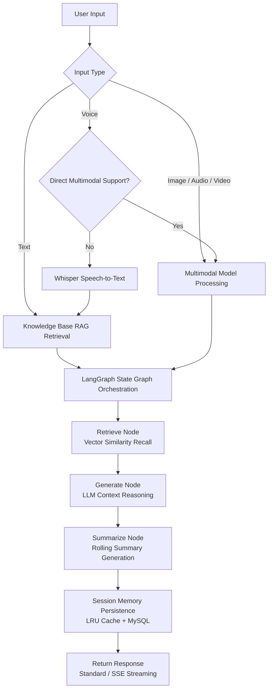
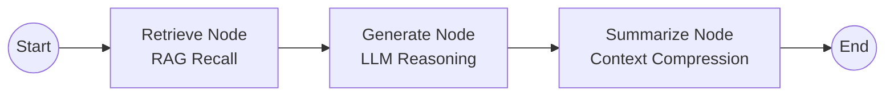

[中文](README.md) | English

# XiChuang

<p>


</p>

---

## 1. Project Introduction

**XiChuang** is a multimodal intelligent assistant built with **LangChain + LangGraph + FastAPI**. The name originates from the famous Chinese poem by Li Shangyin: "When can we trim the candle by the western window, and talk about the rainy night in Ba Mountain."

Positioned as a **production-grade AI backend service**, its core values include:

- **Multimodal Interaction**: Supports text chat, voice recording, and image/audio/video file uploads, covering mainstream human-computer interaction scenarios
- **Multi-Model Adaptation**: Built-in support for Tongyi Qwen, DeepSeek, Zhipu GLM, Doubao, and Kimi providers with dynamic switching and automatic fallback
- **LangGraph Orchestration**: State graph-based conversation flow (Retrieve → Generate → Summarize), ensuring observability and controllability of complex dialogue chains
- **Intelligent Memory Management**: Persistent session memory + LRU cache + rolling summary generation, balancing context coherence with resource efficiency
- **RAG Knowledge Enhancement**: Retrieval-Augmented Generation powered by Milvus vector database, supporting document vectorization and semantic search
- **Production-Ready Engineering**: IOC dependency injection, unified exception hierarchy, structured logging, middleware chain, health check probes, and other production-grade infrastructure

**Use Cases**: Intelligent customer service, knowledge Q&A, multimodal content analysis, AI application prototyping, and LangChain/LangGraph learning and practice.

---

## 2. Quick Start

### 2.1 System Requirements

| Dependency | Version | Description |
|------------|---------|-------------|
| **Python** | ≥ 3.11 | Core runtime |
| **uv** | Latest | Package manager (recommended over pip) |
| **MySQL** | ≥ 8.0 | Session persistence storage (optional, included in Docker deployment) |
| **Milvus** | ≥ 2.x | Vector database (optional, included in Docker deployment) |
| **Docker** | ≥ 20.10 | Containerized deployment (optional) |

**Platform Notes**:

| Platform | Notes |
|----------|-------|
| **Windows** | PowerShell or Git Bash recommended; pydub audio processing depends on ffmpeg, but the project includes `imageio-ffmpeg` as a built-in fallback — no manual installation required |
| **Linux** | Install `libmagic` (`sudo apt install libmagic1`) for file type detection |
| **macOS** | For system-level ffmpeg, install via `brew install ffmpeg` |

### 2.2 Clone the Repository

```bash
# Clone the repository
git clone https://gitee.com/chain-engine/x-XiChuang.git

# Enter the backend project directory
cd x-XiChuang/server
```

### 2.3 Install Dependencies

```bash
# Install uv (if not already installed)
# Windows (PowerShell)
powershell -ExecutionPolicy ByPass -c "irm https://astral.sh/uv/install.ps1 | iex"
# Linux / macOS
curl -LsSf https://astral.sh/uv/install.sh | sh

# Create virtual environment
uv venv

# Activate virtual environment
# Linux / macOS
source .venv/bin/activate
# Windows (PowerShell)
.venv\Scripts\Activate.ps1
# Windows (CMD)
.venv\Scripts\activate.bat

# Sync project dependencies
uv sync

# Install development dependencies (optional)
uv sync --extra dev
```

### 2.4 Environment Configuration

```bash
# Copy the environment variable template
cp .env.example .env
```

Edit the `.env` file and configure the core parameters:

| Variable | Description | Default | Required |
|----------|-------------|---------|----------|
| `ALIYUN_API_KEY` | Alibaba Cloud Qwen API Key | - | Recommended (default model) |
| `DEEPSEEK_API_KEY` | DeepSeek API Key | - | Optional |
| `GLM_API_KEY` | Zhipu GLM API Key | - | Optional |
| `DOUBAO_API_KEY` | Volcano Doubao API Key | - | Optional |
| `KIMI_API_KEY` | Kimi / Moonshot API Key | - | Optional |
| `OPENAI_API_KEY` | OpenAI API Key (Whisper STT) | - | Optional |
| `TEMPERATURE` | Model generation temperature | `0` | No |
| `MAX_TOKENS` | Maximum tokens to generate | `4096` | No |
| `REQUEST_TIMEOUT` | Request timeout in seconds | `120` | No |
| `MYSQL_HOST` | MySQL host address | `127.0.0.1` | Required for Docker |
| `MYSQL_PORT` | MySQL port | `3306` | No |
| `MYSQL_USER` | MySQL username | `root` | Required for Docker |
| `MYSQL_PASSWORD` | MySQL password | - | Required for Docker |
| `MYSQL_DATABASE` | MySQL database name | `XiChuang` | No |
| `MILVUS_HOST` | Milvus host address | `localhost` | No |
| `MILVUS_PORT` | Milvus port | `19530` | No |
| `STORAGE_TYPE` | File storage type (`local` / `oss`) | `local` | No |
| `LOG_LEVEL` | Log level | `DEBUG` (dev) / `INFO` (prod) | No |
| `ENVIRONMENT` | Runtime environment | `development` | No |

> **Note**: At least one model provider API Key must be configured, otherwise the chat feature will not work. It is recommended to configure `ALIYUN_API_KEY` first, as the project uses Tongyi Qwen as the default model.

### 2.5 Start the Service

#### Option 1: Local Development with Hot Reload (Recommended for Development)

```bash
# Ensure the virtual environment is activated
uv run uvicorn src.main:app --reload --host 0.0.0.0 --port 8000
```

After starting, visit:
- Application homepage: http://localhost:8000
- Swagger docs: http://localhost:8000/docs
- ReDoc docs: http://localhost:8000/redoc

#### Option 2: Docker Container Deployment (Recommended for Production)

```bash
# 1. Return to the project root directory
cd ..

# 2. Configure environment variables
cp server/.env.example .env
# Edit the .env file with your API Keys and database configuration

# 3. Start all services (MySQL + Milvus + Application)
docker-compose up -d

# 4. View application logs
docker-compose logs -f app

# 5. Stop all services
docker-compose down
```

#### Option 3: Run Entry Script Directly

```bash
# Use the registered CLI command
uv run XiChuang
```

### 2.6 Common Engineering Commands

```bash
# Run all unit tests
uv run pytest

# Run tests with coverage report
uv run pytest --cov=src --cov-report=html

# Code formatting
uv run ruff format .

# Static code analysis
uv run ruff check .

# Static code analysis with auto-fix
uv run ruff check --fix .

# Type checking
uv run mypy .

# Dependency vulnerability scanning
uvx pip-audit
```

### 2.7 Usage Examples

**Standard Text Chat**:

```bash
curl -X POST http://localhost:8000/api/v1/conversations/message \
  -H "Content-Type: application/json" \
  -d '{
    "message": "Hello, please introduce yourself",
    "model_provider": "tongyi"
  }'
```

**Streaming Chat (SSE)**:

```bash
curl -X POST http://localhost:8000/api/v1/conversations/stream \
  -H "Content-Type: application/json" \
  -d '{
    "message": "Write a quicksort in Python",
    "model_provider": "tongyi",
    "stream": true
  }'
```

**File Upload Chat**:

```bash
curl -X POST http://localhost:8000/api/v1/conversations/upload \
  -F "file=@image.png" \
  -F "message=Describe this image" \
  -F "model_provider=tongyi"
```

**List Available Models**:

```bash
curl http://localhost:8000/api/v1/conversations/providers
```

---

## 3. Project Structure

```
server/
├── src/                            # Source code directory
│   ├── main.py                     # FastAPI application entry, lifecycle management
│   │
│   ├── core/                       # Core layer — infrastructure & cross-cutting concerns
│   │   ├── config.py               # Global configuration management (dataclass + env vars)
│   │   ├── container.py            # IOC dependency injection container (singleton/transient, auto-wiring)
│   │   ├── exceptions.py           # Unified exception hierarchy (BusinessException / SystemException)
│   │   ├── logger.py               # Logging wrapper (Loguru, JSON file + colored console)
│   │   └── middleware.py           # Middleware chain (RequestID, logging, exception, auth)
│   │
│   ├── constants/                  # Constants layer — enums & status codes
│   │   ├── base.py                 # Base enum class (BaseEnum)
│   │   └── enums.py                # Business enums (ModelProvider, MediaType, ResponseCode)
│   │
│   ├── schemas/                    # Schema layer — Pydantic data models
│   │   ├── common.py               # Common models (pagination, sorting, unified response)
│   │   ├── chat.py                 # Chat models (ChatRequest/Response/StreamChunk)
│   │   ├── conversation.py         # Conversation models (CRUD request/response)
│   │   ├── health.py               # Health check models
│   │   └── milvus.py               # Milvus models (collections, search, stats)
│   │
│   ├── models/                     # Data model layer — ORM entities
│   │   └── entities/
│   │       ├── conversation_entity.py  # Conversation entity (UUID primary key, with summary & model info)
│   │       └── message_entity.py       # Message entity (role, content, timestamp)
│   │
│   ├── repositories/               # Data access layer — Repository pattern
│   │   ├── base.py                 # Repository base class (generic CRUD)
│   │   └── conversation.py         # Conversation repository (conversation + message joint queries)
│   │
│   ├── services/                   # Business logic layer
│   │   ├── base.py                 # Service base class
│   │   ├── chat_service.py         # Chat service (LangGraph state graph orchestration)
│   │   ├── chat_helpers.py         # Chat helpers (provider resolution, message conversion)
│   │   ├── conversation_service.py # Conversation service (CRUD + persistence)
│   │   ├── health_service.py       # Health check service
│   │   └── milvus_service.py       # Milvus service (vector store management)
│   │
│   ├── api/                        # API routing layer
│   │   ├── response.py             # Unified response wrapper
│   │   ├── router.py               # Route aggregation & registration
│   │   └── v1/
│   │       ├── health.py           # Health check routes (/health, /live, /ready, /version)
│   │       ├── conversations.py    # Conversation routes (CRUD + AI chat)
│   │       └── milvus.py           # Milvus routes (vector store management + knowledge base)
│   │
│   ├── agent/                      # AI agent layer
│   │   ├── model.py                # Model router (multi-provider priority selection)
│   │   ├── multimodal.py           # Multimodal processing (STT, image/video understanding)
│   │   ├── memory.py               # Session memory (LRU cache + MySQL persistence + rolling summary)
│   │   └── knowledge.py            # Knowledge retrieval (RAG, Milvus + DashScope embeddings)
│   │
│   ├── infras/                     # Infrastructure layer
│   │   ├── database.py             # Database connection (SQLAlchemy 2.0 async engine)
│   │   ├── milvus.py               # Milvus client wrapper
│   │   └── storage.py              # File storage abstraction (local / Alibaba Cloud OSS)
│   │
│   └── utils/                      # Utility layer
│       ├── authentication.py       # Authentication utilities
│       ├── compression.py          # Compression utilities
│       ├── convert.py              # Format conversion (XML/JSON/YAML)
│       ├── file.py                 # File operations (hash, search, read)
│       ├── id_generator.py         # ID generator (UUID, timestamp)
│       ├── text.py                 # Text processing (KMP search, pinyin, hash)
│       └── ...                     # Other utility modules
│
├── tests/                          # Unit test directory
├── logs/                           # Runtime logs directory
├── scripts/                        # Scripts directory
├── .env.example                    # Environment variable template
├── pyproject.toml                  # Project metadata & dependency declaration
└── LICENSE                         # MIT License
```

---

## 4. System Architecture

### Layered Architecture

```mermaid
graph TB
    subgraph Frontend
        WEB[Vue3 SPA Frontend]
    end

    subgraph Gateway
        FASTAPI[FastAPI Gateway]
        MW[Middleware Chain<br/>RequestID · Logging · Exception · Auth]
    end

    subgraph API Layer
        HEALTH[Health Check Routes]
        CONV[Conversation Routes]
        MILVUS_API[Milvus Routes]
    end

    subgraph Service Layer
        CS[ChatService<br/>LangGraph Orchestration]
        CVS[ConversationService<br/>Session Management]
        MS[MilvusService<br/>Vector Store Management]
    end

    subgraph Agent Layer
        MODEL[Model Router]
        MULTI[Multimodal Processing]
        MEM[Session Memory]
        KB[RAG Knowledge Retrieval]
    end

    subgraph Infrastructure
        MYSQL[(MySQL<br/>Session Persistence)]
        MILVUS[(Milvus<br/>Vector Storage)]
        STORE[File Storage<br/>Local / OSS]
    end

    subgraph LLM Providers
        TONGYI[Tongyi Qwen]
        DS[DeepSeek]
        GLM[Zhipu GLM]
        DB_MODEL[Doubao]
        KIMI[Kimi]
    end

    WEB --> FASTAPI
    FASTAPI --> MW
    MW --> API Layer
    API Layer --> Service Layer
    Service Layer --> Agent Layer
    Agent Layer --> LLM Providers
    Service Layer --> Infrastructure
    Agent Layer --> Infrastructure
```

### Core Chat Flow



### LangGraph Conversation Orchestration



---

## 5. Tech Stack

### Programming Language

| Technology | Version | Description |
|------------|---------|-------------|
| Python | 3.11+ | Core programming language |

### Web Framework

| Technology | Version | Description |
|------------|---------|-------------|
| FastAPI | 0.111+ | High-performance async web framework |
| Uvicorn | Latest | ASGI server |
| Pydantic | v2 | Data validation & serialization |
| python-multipart | Latest | File upload support |

### AI / LLM Framework

| Technology | Version | Description |
|------------|---------|-------------|
| LangChain | 0.3+ | LLM application framework |
| LangGraph | 0.1+ | State graph-based LLM flow orchestration |
| LangChain-OpenAI | 0.2+ | OpenAI-compatible interface adapter |
| DashScope | 1.14+ | Alibaba Cloud Bailian SDK (embedding models) |
| OpenAI | 1.37+ | Whisper speech-to-text |

### Data Storage

| Technology | Version | Description |
|------------|---------|-------------|
| MySQL | 8.0+ | Relational database for session & message persistence |
| SQLAlchemy | 2.0+ | Async ORM framework |
| PyMySQL / aiomysql | Latest | MySQL drivers (sync + async) |
| Milvus | 2.x | Vector database for knowledge base semantic retrieval |
| pymilvus | 2.3+ | Milvus Python SDK |

### File Storage

| Technology | Version | Description |
|------------|---------|-------------|
| Local Filesystem | - | Default storage for development |
| Alibaba Cloud OSS | - | Object storage for production (oss2) |

### Multimedia Processing

| Technology | Version | Description |
|------------|---------|-------------|
| Pillow | 10.3+ | Image processing |
| pydub | 0.25+ | Audio format conversion |
| imageio-ffmpeg | 0.5+ | Built-in ffmpeg fallback |

### Core Libraries

| Technology | Version | Description |
|------------|---------|-------------|
| Loguru | 0.7+ | Structured logging |
| httpx | 0.27+ | Async HTTP client |
| orjson | 3.10+ | High-performance JSON serialization |
| python-dotenv | 1.0+ | Environment variable loading |
| slowapi | 0.1+ | API rate limiting |

### Deployment & Operations

| Technology | Version | Description |
|------------|---------|-------------|
| Docker | 20.10+ | Containerized deployment |
| Docker Compose | Latest | Multi-service orchestration (MySQL + Milvus + App) |

### Development Tools

| Technology | Version | Description |
|------------|---------|-------------|
| uv | Latest | Python package management & virtual environment |
| Ruff | 0.5+ | Code formatting & static analysis |
| mypy | 1.10+ | Static type checking |
| pytest | 8.2+ | Unit testing framework |
| pytest-asyncio | 0.23+ | Async testing support |
| pytest-cov | 5.0+ | Test coverage |

---

## 6. API Documentation

### Interactive Documentation

After starting the service, access the API documentation at:

| Document | URL | Description |
|----------|-----|-------------|
| **Swagger UI** | http://localhost:8000/docs | Interactive API docs with online debugging |
| **ReDoc** | http://localhost:8000/redoc | Read-only API docs, well-structured |
| **OpenAPI JSON** | http://localhost:8000/openapi.json | OpenAPI 3.0 specification file |

### Core API Endpoints

#### Health Check

| Endpoint | Method | Description |
|----------|--------|-------------|
| `/api/v1/health` | GET | Full health check (database, Milvus connectivity) |
| `/api/v1/health/live` | GET | Liveness probe (Kubernetes liveness probe) |
| `/api/v1/health/ready` | GET | Readiness probe (Kubernetes readiness probe) |
| `/api/v1/version` | GET | Version information |
| `/api/v1/config/summary` | GET | Configuration summary (sanitized) |

#### Conversation Management & AI Chat

| Endpoint | Method | Description |
|----------|--------|-------------|
| `/api/v1/conversations` | GET | Conversation list (paginated, searchable, filterable) |
| `/api/v1/conversations` | POST | Create conversation |
| `/api/v1/conversations/{id}` | GET | Conversation detail (with message history) |
| `/api/v1/conversations/{id}/update` | POST | Update conversation |
| `/api/v1/conversations/{id}/delete` | POST | Delete conversation |
| `/api/v1/conversations/{id}/messages` | POST | Save messages |
| `/api/v1/conversations/message` | POST | Standard AI chat (JSON response) |
| `/api/v1/conversations/stream` | POST | Streaming AI chat (SSE) |
| `/api/v1/conversations/upload` | POST | File upload chat (image/audio/video) |
| `/api/v1/conversations/providers` | GET | List available model providers |

#### Knowledge Base & Milvus Management

| Endpoint | Method | Description |
|----------|--------|-------------|
| `/api/v1/milvus/stats` | GET | Milvus server statistics |
| `/api/v1/milvus/knowledge-status` | GET | Knowledge base build diagnostics |
| `/api/v1/milvus/rebuild-knowledge` | POST | Force rebuild knowledge base |
| `/api/v1/milvus/collections` | GET | List all collections |
| `/api/v1/milvus/collections/{name}` | GET | Get collection details |
| `/api/v1/milvus/search` | POST | Vector semantic search |
| `/api/v1/milvus/data/delete` | POST | Delete vector data |
| `/api/v1/milvus/collections/drop` | POST | Drop collection |

### Access Control

- **API Key Authentication**: Implemented via `ApiKeyMiddleware` in the middleware layer
- **CORS Policy**: Configurable cross-origin whitelist, allows all origins by default (development mode)
- **Rate Limiting**: API rate limiting based on `slowapi`

---

## 7. Storage Configuration

### Local File Storage (Default)

Suitable for development environments. Files are saved in the `server/statics/` directory:

| Directory | Purpose |
|-----------|---------|
| `statics/images/` | Image files |
| `statics/audio/` | Audio files |
| `statics/videos/` | Video files |
| `statics/files/` | Other files |

Configuration:

```bash
STORAGE_TYPE=local
STATIC_DIR=server/statics
```

### Alibaba Cloud OSS Object Storage

Suitable for production environments. Files are uploaded to Alibaba Cloud OSS:

```bash
STORAGE_TYPE=oss
ALIYUN_OSS_ACCESS_KEY_ID=your-access-key-id
ALIYUN_OSS_ACCESS_KEY_SECRET=your-access-key-secret
ALIYUN_OSS_ENDPOINT=oss-cn-hangzhou.aliyuncs.com
ALIYUN_OSS_BUCKET_NAME=your-bucket-name
```

**Notes**:
- Previously uploaded files will not be migrated automatically when switching storage types
- All new uploads will be stored in the cloud once OSS configuration is active
- File access URLs are automatically generated by the storage provider

### MySQL Database Storage

Used for persistent storage of conversations and messages. Data structure:

| Table | Fields | Description |
|-------|--------|-------------|
| `conversations` | `id` (UUID), `title`, `summary`, `model_provider`, `created_at`, `updated_at` | Conversations table |
| `messages` | `id` (auto-increment), `conversation_id` (FK), `role`, `content`, `created_at` | Messages table |

Configuration:

```bash
MYSQL_HOST=127.0.0.1
MYSQL_PORT=3306
MYSQL_USER=root
MYSQL_PASSWORD=your-password
MYSQL_DATABASE=xichuang
```

**Connection pool defaults**: `pool_size=5`, `max_overflow=10`, `pool_recycle=3600`, `pool_pre_ping=True`

### Milvus Vector Database

Used for vectorized storage and semantic retrieval of knowledge base documents:

```bash
MILVUS_HOST=localhost
MILVUS_PORT=19530
MILVUS_USER=
MILVUS_PASSWORD=
```

**Embedding model**: Uses Alibaba Cloud `text-embedding-v1` by default. Requires `ALIYUN_API_KEY` to be configured.

---

## 8. License

This project is licensed under the [MIT License](LICENSE).

> The MIT License allows anyone to freely use, copy, modify, merge, publish, distribute, sublicense, and/or sell copies of the software, with the sole requirement that the copyright notice and permission notice be included in all copies or substantial portions of the software.

---

## 9. References

| Technology | Official Documentation |
|------------|----------------------|
| Python | https://docs.python.org/3/ |
| uv | https://docs.astral.sh/uv/ |
| FastAPI | https://fastapi.tiangolo.com/ |
| LangChain | https://python.langchain.com/ |
| LangGraph | https://langchain-ai.github.io/langgraph/ |
| Milvus | https://milvus.io/docs |
| pymilvus | https://pymilvus.readthedocs.io/ |
| SQLAlchemy | https://docs.sqlalchemy.org/ |
| Pydantic | https://docs.pydantic.dev/ |
| Loguru | https://loguru.readthedocs.io/ |
| Ruff | https://docs.astral.sh/ruff/ |
| Docker | https://docs.docker.com/ |
| Docker Compose | https://docs.docker.com/compose/ |
| DashScope | https://help.aliyun.com/zh/dashscope/ |
| pytest | https://docs.pytest.org/ |

---

## 10. Contact

- **Author**: John Young
- **Email**: john.young@foxmail.com
- **Gitee**: https://gitee.com/yeyushilai
- **GitHub**: https://github.com/yeyushilai
- **Project**: https://gitee.com/chain-engine/x-XiChuang
