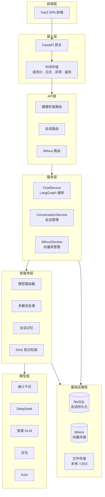
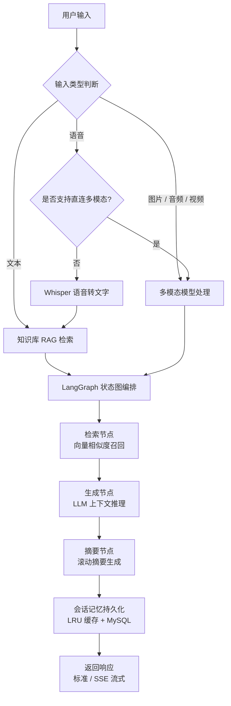
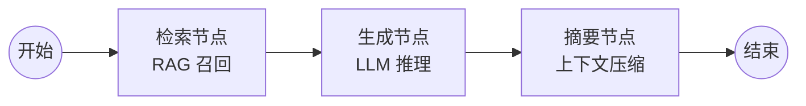

[English](README.en.md) | 中文

# 西窗（XiChuang）

<p>


</p>

---

## 一、项目简介

**西窗（XiChuang）** 是一款基于 **LangChain + LangGraph + FastAPI** 构建的多模态智能交互助手，当前目录定位为 **生产级 AI 应用后端服务**，核心价值在于：

- **多模态交互**：支持文本对话、语音录制、图片/音频/视频文件上传，覆盖主流人机交互场景
- **多模型适配**：内置通义千问、DeepSeek、智谱 GLM、豆包、Kimi 五大模型提供商，支持动态切换与故障兜底
- **LangGraph 编排**：基于状态图的对话流程编排（检索 → 生成 → 摘要），保障复杂对话链路的可观测性与可控性
- **智能记忆管理**：会话记忆持久化 + LRU 缓存 + 滚动摘要生成，兼顾上下文连贯性与资源效率
- **RAG 知识增强**：基于 Milvus 向量数据库的检索增强生成，支持文档向量化与语义搜索
- **工程化开箱即用**：IOC 依赖注入、统一异常体系、结构化日志、中间件链、健康检查探针等生产级基础设施

**适用场景**：智能客服、知识问答、多模态内容分析、AI 应用原型验证、LangChain/LangGraph 技术学习与实践。

---

## 二、快速开始

### 1. 环境要求

| 依赖项 | 版本要求 | 说明 |
|--------|----------|------|
| **Python** | ≥ 3.11 | 核心运行时 |
| **uv** | 最新版 | 包管理工具（推荐替代 pip） |
| **MySQL** | ≥ 8.0 | 会话持久化存储（可选，Docker 部署自带） |
| **Milvus** | ≥ 2.x | 向量数据库（可选，Docker 部署自带） |
| **Docker** | ≥ 20.10 | 容器化部署（可选） |

**平台适配说明**：

| 平台 | 注意事项 |
|------|----------|
| **Windows** | 推荐使用 PowerShell 或 Git Bash；pydub 音频处理依赖 ffmpeg，项目已内置 `imageio-ffmpeg` 兜底方案，无需手动安装 |
| **Linux** | 建议安装 `libmagic`（`sudo apt install libmagic1`）以支持文件类型检测 |
| **macOS** | 如需系统级 ffmpeg，可通过 `brew install ffmpeg` 安装 |

### 2. 项目代码克隆

```bash
# 克隆仓库
git clone https://gitee.com/yeyushilai/x-XiChuang.git

# 进入后端项目目录
cd x-XiChuang/server
```

### 3. 依赖同步安装

```bash
# 安装 uv（如尚未安装）
pip install uv

# 创建虚拟环境
uv venv

# 激活虚拟环境
# Linux / macOS
source .venv/bin/activate
# Windows (PowerShell)
.venv\Scripts\Activate.ps1
# Windows (CMD)
.venv\Scripts\activate.bat

# 同步项目依赖
uv sync

# 安装开发依赖（可选）
uv sync --extra dev
```

### 4. 环境配置

```bash
# 复制环境变量模板
cp .env.example .env
```

编辑 `.env` 文件，配置核心参数：

| 配置项 | 说明 | 默认值 | 必填 |
|--------|------|--------|------|
| `ALIYUN_API_KEY` | 阿里云千问 API Key | - | 推荐（默认模型） |
| `DEEPSEEK_API_KEY` | DeepSeek API Key | - | 可选 |
| `GLM_API_KEY` | 智谱 GLM API Key | - | 可选 |
| `DOUBAO_API_KEY` | 火山豆包 API Key | - | 可选 |
| `KIMI_API_KEY` | Kimi / 月之暗面 API Key | - | 可选 |
| `OPENAI_API_KEY` | OpenAI API Key（Whisper 语音转文字） | - | 可选 |
| `TEMPERATURE` | 模型生成温度 | `0` | 否 |
| `MAX_TOKENS` | 最大生成 Token 数 | `4096` | 否 |
| `REQUEST_TIMEOUT` | 请求超时时间（秒） | `120` | 否 |
| `MYSQL_HOST` | MySQL 主机地址 | `127.0.0.1` | Docker 部署必填 |
| `MYSQL_PORT` | MySQL 端口 | `3306` | 否 |
| `MYSQL_USER` | MySQL 用户名 | `root` | Docker 部署必填 |
| `MYSQL_PASSWORD` | MySQL 密码 | - | Docker 部署必填 |
| `MYSQL_DATABASE` | MySQL 数据库名 | `XiChuang` | 否 |
| `MILVUS_HOST` | Milvus 主机地址 | `localhost` | 否 |
| `MILVUS_PORT` | Milvus 端口 | `19530` | 否 |
| `STORAGE_TYPE` | 文件存储类型（`local` / `oss`） | `local` | 否 |
| `LOG_LEVEL` | 日志级别 | `DEBUG`（开发）/ `INFO`（生产） | 否 |
| `ENVIRONMENT` | 运行环境 | `development` | 否 |

> **提示**：至少配置一个模型提供商的 API Key，否则对话功能不可用。推荐优先配置 `ALIYUN_API_KEY`，项目默认使用通义千问作为首选模型。

### 5. 服务启动

#### 方式一：本地开发热重载启动（推荐开发阶段）

```bash
# 确保已激活虚拟环境
uv run uvicorn src.main:app --reload --host 0.0.0.0 --port 8000
```

启动后访问：
- 应用首页：http://localhost:8000
- Swagger 文档：http://localhost:8000/docs
- ReDoc 文档：http://localhost:8000/redoc

#### 方式二：Docker 容器部署（推荐生产环境）

```bash
# 1. 回到项目根目录
cd ..

# 2. 配置环境变量
cp server/.env.example .env
# 编辑 .env 文件，填写 API Key 及数据库配置

# 3. 启动所有服务（MySQL + Milvus + 应用）
docker-compose up -d

# 4. 查看应用日志
docker-compose logs -f app

# 5. 停止所有服务
docker-compose down
```

#### 方式三：直接运行入口脚本

```bash
# 使用项目注册的 CLI 命令
uv run XiChuang
```

### 6. 常用工程命令

```bash
# 运行全部单元测试
uv run pytest

# 运行测试并生成覆盖率报告
uv run pytest --cov=src --cov-report=html

# 代码格式化
uv run ruff format .

# 静态代码检查
uv run ruff check .

# 静态代码检查并自动修复
uv run ruff check --fix .

# 类型检查
uv run mypy .

# 依赖漏洞扫描
pip install pip-audit && pip-audit
```

### 7. 使用方法示例

**标准文本对话**：

```bash
curl -X POST http://localhost:8000/api/v1/conversations/message \
  -H "Content-Type: application/json" \
  -d '{
    "message": "你好，请介绍一下自己",
    "model_provider": "tongyi"
  }'
```

**流式对话（SSE）**：

```bash
curl -X POST http://localhost:8000/api/v1/conversations/stream \
  -H "Content-Type: application/json" \
  -d '{
    "message": "用 Python 写一个快速排序",
    "model_provider": "tongyi",
    "stream": true
  }'
```

**文件上传对话**：

```bash
curl -X POST http://localhost:8000/api/v1/conversations/upload \
  -F "file=@image.png" \
  -F "message=描述一下这张图片" \
  -F "model_provider=tongyi"
```

**查看可用模型**：

```bash
curl http://localhost:8000/api/v1/conversations/providers
```

---

## 三、项目结构

```
server/
├── src/                            # 源代码目录
│   ├── main.py                     # FastAPI 应用入口，生命周期管理
│   │
│   ├── core/                       # 核心层 — 基础设施与横切关注点
│   │   ├── config.py               # 全局配置管理（dataclass + 环境变量）
│   │   ├── container.py            # IOC 依赖注入容器（单例/瞬态，自动装配）
│   │   ├── exceptions.py           # 统一异常体系（BusinessException / SystemException）
│   │   ├── logger.py               # 日志封装（Loguru，JSON 文件 + 彩色控制台）
│   │   └── middleware.py           # 中间件链（请求ID、日志、异常、鉴权）
│   │
│   ├── constants/                  # 常量层 — 枚举与状态码
│   │   ├── base.py                 # 基础枚举类（BaseEnum）
│   │   └── enums.py                # 业务枚举（ModelProvider、MediaType、ResponseCode）
│   │
│   ├── schemas/                    # Schema 层 — Pydantic 数据模型
│   │   ├── common.py               # 通用模型（分页、排序、统一响应）
│   │   ├── chat.py                 # 对话模型（ChatRequest/Response/StreamChunk）
│   │   ├── conversation.py         # 会话模型（CRUD 请求/响应）
│   │   ├── health.py               # 健康检查模型
│   │   └── milvus.py               # Milvus 模型（集合、搜索、统计）
│   │
│   ├── models/                     # 数据模型层 — ORM 实体
│   │   └── entities/
│   │       ├── conversation_entity.py  # 会话实体（UUID 主键，含摘要与模型信息）
│   │       └── message_entity.py       # 消息实体（角色、内容、时间戳）
│   │
│   ├── repositories/               # 数据访问层 — Repository 模式
│   │   ├── base.py                 # 仓储基类（通用 CRUD）
│   │   └── conversation.py         # 会话仓储（会话 + 消息联合查询）
│   │
│   ├── services/                   # 业务逻辑层
│   │   ├── base.py                 # 服务基类
│   │   ├── chat_service.py         # 对话服务（LangGraph 状态图编排）
│   │   ├── chat_helpers.py         # 对话辅助（provider 解析、消息转换）
│   │   ├── conversation_service.py # 会话服务（CRUD + 持久化）
│   │   ├── health_service.py       # 健康检查服务
│   │   └── milvus_service.py       # Milvus 服务（向量库管理）
│   │
│   ├── api/                        # API 路由层
│   │   ├── response.py             # 统一响应封装
│   │   ├── router.py               # 路由聚合注册
│   │   └── v1/
│   │       ├── health.py           # 健康检查路由（/health, /live, /ready, /version）
│   │       ├── conversations.py    # 会话路由（CRUD + AI 对话）
│   │       └── milvus.py           # Milvus 路由（向量库管理 + 知识库）
│   │
│   ├── agent/                      # AI 智能体层
│   │   ├── model.py                # 模型路由器（多提供商优先级选择）
│   │   ├── multimodal.py           # 多模态处理（语音转文字、图片/视频理解）
│   │   ├── memory.py               # 会话记忆（LRU 缓存 + MySQL 持久化 + 滚动摘要）
│   │   └── knowledge.py            # 知识库检索（RAG，Milvus + DashScope 嵌入）
│   │
│   ├── infras/                     # 基础设施层
│   │   ├── database.py             # 数据库连接（SQLAlchemy 2.0 异步引擎）
│   │   ├── milvus.py               # Milvus 客户端封装
│   │   └── storage.py              # 文件存储抽象（本地 / 阿里云 OSS）
│   │
│   └── utils/                      # 工具层
│       ├── authentication.py       # 认证工具
│       ├── compression.py          # 压缩工具
│       ├── convert.py              # 格式转换（XML/JSON/YAML）
│       ├── file.py                 # 文件操作（哈希、搜索、读取）
│       ├── id_generator.py         # ID 生成器（UUID、时间戳）
│       ├── text.py                 # 文本处理（KMP 搜索、拼音、哈希）
│       └── ...                     # 其他工具模块
│
├── tests/                          # 单元测试目录
├── logs/                           # 运行日志目录
├── scripts/                        # 脚本目录
├── .env.example                    # 环境变量模板
├── pyproject.toml                  # 项目元数据与依赖声明
└── LICENSE                         # MIT 开源协议
```

---

## 四、系统架构

### 系统分层架构



### 核心对话流程



### LangGraph 对话编排流程



---

## 五、技术栈

### 开发语言

| 技术 | 版本 | 说明 |
|------|------|------|
| Python | 3.11+ | 核心开发语言 |

### Web 框架

| 技术 | 版本 | 说明 |
|------|------|------|
| FastAPI | 0.111+ | 高性能异步 Web 框架 |
| Uvicorn | 最新版 | ASGI 服务器 |
| Pydantic | v2 | 数据校验与序列化 |
| python-multipart | 最新版 | 文件上传支持 |

### AI / LLM 框架

| 技术 | 版本 | 说明 |
|------|------|------|
| LangChain | 0.3+ | 大语言模型应用框架 |
| LangGraph | 0.1+ | 基于状态图的 LLM 流程编排 |
| LangChain-OpenAI | 0.2+ | OpenAI 兼容接口适配 |
| DashScope | 1.14+ | 阿里云百炼 SDK（嵌入模型） |
| OpenAI | 1.37+ | Whisper 语音转文字 |

### 数据存储

| 技术 | 版本 | 说明 |
|------|------|------|
| MySQL | 8.0+ | 关系型数据库，会话与消息持久化 |
| SQLAlchemy | 2.0+ | 异步 ORM 框架 |
| PyMySQL / aiomysql | 最新版 | MySQL 驱动（同步 + 异步） |
| Milvus | 2.x | 向量数据库，知识库语义检索 |
| pymilvus | 2.3+ | Milvus Python SDK |

### 文件存储

| 技术 | 版本 | 说明 |
|------|------|------|
| 本地文件系统 | - | 开发环境默认存储 |
| 阿里云 OSS | - | 生产环境对象存储（oss2） |

### 多媒体处理

| 技术 | 版本 | 说明 |
|------|------|------|
| Pillow | 10.3+ | 图像处理 |
| pydub | 0.25+ | 音频格式转换 |
| imageio-ffmpeg | 0.5+ | ffmpeg 内置兜底方案 |

### 核心工具库

| 技术 | 版本 | 说明 |
|------|------|------|
| Loguru | 0.7+ | 结构化日志 |
| httpx | 0.27+ | 异步 HTTP 客户端 |
| orjson | 3.10+ | 高性能 JSON 序列化 |
| python-dotenv | 1.0+ | 环境变量加载 |
| slowapi | 0.1+ | API 限流 |

### 部署运维

| 技术 | 版本 | 说明 |
|------|------|------|
| Docker | 20.10+ | 容器化部署 |
| Docker Compose | 最新版 | 多服务编排（MySQL + Milvus + 应用） |

### 开发工具

| 技术 | 版本 | 说明 |
|------|------|------|
| uv | 最新版 | Python 包管理与虚拟环境 |
| Ruff | 0.5+ | 代码格式化与静态检查 |
| mypy | 1.10+ | 静态类型检查 |
| pytest | 8.2+ | 单元测试框架 |
| pytest-asyncio | 0.23+ | 异步测试支持 |
| pytest-cov | 5.0+ | 测试覆盖率 |

---

## 六、API 文档说明

### 交互式文档

服务启动后，可通过以下地址访问 API 文档：

| 文档类型 | 访问地址 | 说明 |
|----------|----------|------|
| **Swagger UI** | http://localhost:8000/docs | 交互式 API 文档，支持在线调试 |
| **ReDoc** | http://localhost:8000/redoc | 只读 API 文档，结构清晰 |
| **OpenAPI JSON** | http://localhost:8000/openapi.json | OpenAPI 3.0 规范文件 |

### 核心 API 接口清单

#### 健康检查

| 接口 | 方法 | 说明 |
|------|------|------|
| `/api/v1/health` | GET | 完整健康检查（数据库、Milvus 连通状态） |
| `/api/v1/health/live` | GET | 存活探针（Kubernetes liveness probe） |
| `/api/v1/health/ready` | GET | 就绪探针（Kubernetes readiness probe） |
| `/api/v1/version` | GET | 版本信息 |
| `/api/v1/config/summary` | GET | 配置摘要（脱敏） |

#### 会话管理与 AI 对话

| 接口 | 方法 | 说明 |
|------|------|------|
| `/api/v1/conversations` | GET | 会话列表（分页、搜索、筛选） |
| `/api/v1/conversations` | POST | 创建会话 |
| `/api/v1/conversations/{id}` | GET | 会话详情（含消息历史） |
| `/api/v1/conversations/{id}/update` | POST | 更新会话 |
| `/api/v1/conversations/{id}/delete` | POST | 删除会话 |
| `/api/v1/conversations/{id}/messages` | POST | 保存消息 |
| `/api/v1/conversations/message` | POST | AI 标准对话（JSON 响应） |
| `/api/v1/conversations/stream` | POST | AI 流式对话（SSE） |
| `/api/v1/conversations/upload` | POST | 文件上传对话（图片/音频/视频） |
| `/api/v1/conversations/providers` | GET | 可用模型提供商列表 |

#### 知识库与 Milvus 管理

| 接口 | 方法 | 说明 |
|------|------|------|
| `/api/v1/milvus/stats` | GET | Milvus 服务器统计信息 |
| `/api/v1/milvus/knowledge-status` | GET | 知识库构建诊断 |
| `/api/v1/milvus/rebuild-knowledge` | POST | 强制重建知识库 |
| `/api/v1/milvus/collections` | GET | 列出所有集合 |
| `/api/v1/milvus/collections/{name}` | GET | 获取集合详情 |
| `/api/v1/milvus/search` | POST | 向量语义搜索 |
| `/api/v1/milvus/data/delete` | POST | 删除向量数据 |
| `/api/v1/milvus/collections/drop` | POST | 删除集合 |

### 权限控制

- **API Key 鉴权**：通过中间件层 `ApiKeyMiddleware` 实现接口访问控制
- **CORS 策略**：支持配置跨域白名单，默认允许所有来源（开发模式）
- **请求限流**：基于 `slowapi` 实现 API 速率限制

---

## 七、存储配置说明

### 本地文件存储（默认）

适用于开发环境，文件保存在 `server/statics/` 目录下：

| 目录 | 用途 |
|------|------|
| `statics/images/` | 图片文件 |
| `statics/audio/` | 音频文件 |
| `statics/videos/` | 视频文件 |
| `statics/files/` | 其他文件 |

配置方式：

```bash
STORAGE_TYPE=local
STATIC_DIR=server/statics
```

### 阿里云 OSS 对象存储

适用于生产环境，文件上传至阿里云 OSS：

```bash
STORAGE_TYPE=oss
ALIYUN_OSS_ACCESS_KEY_ID=your-access-key-id
ALIYUN_OSS_ACCESS_KEY_SECRET=your-access-key-secret
ALIYUN_OSS_ENDPOINT=oss-cn-hangzhou.aliyuncs.com
ALIYUN_OSS_BUCKET_NAME=your-bucket-name
```

**注意事项**：
- 切换存储类型后，已上传的文件不会自动迁移
- OSS 配置生效后，所有新上传文件将存储至云端
- 文件访问 URL 由存储提供商自动生成

### MySQL 数据库存储

用于会话与消息的持久化存储，数据结构如下：

| 表 | 字段 | 说明 |
|----|------|------|
| `conversations` | `id` (UUID), `title`, `summary`, `model_provider`, `created_at`, `updated_at` | 会话表 |
| `messages` | `id` (自增), `conversation_id` (外键), `role`, `content`, `created_at` | 消息表 |

配置方式：

```bash
MYSQL_HOST=127.0.0.1
MYSQL_PORT=3306
MYSQL_USER=root
MYSQL_PASSWORD=your-password
MYSQL_DATABASE=xichuang
```

**连接池默认配置**：`pool_size=5`, `max_overflow=10`, `pool_recycle=3600`, `pool_pre_ping=True`

### Milvus 向量数据库

用于知识库文档的向量化存储与语义检索：

```bash
MILVUS_HOST=localhost
MILVUS_PORT=19530
MILVUS_USER=
MILVUS_PASSWORD=
```

**嵌入模型**：默认使用阿里云 `text-embedding-v1`，需配置 `ALIYUN_API_KEY`。

---

## 八、许可证

本项目采用 [MIT License](LICENSE) 开源协议。

> MIT 协议允许任何人自由使用、复制、修改、合并、发布、分发、再许可和/或出售本软件的副本，唯一要求是在所有副本或重要部分中包含版权声明和许可声明。

---

## 九、参考资料

| 技术 | 官方文档 |
|------|----------|
| Python | https://docs.python.org/3/ |
| uv | https://docs.astral.sh/uv/ |
| FastAPI | https://fastapi.tiangolo.com/ |
| LangChain | https://python.langchain.com/ |
| LangGraph | https://langchain-ai.github.io/langgraph/ |
| Milvus | https://milvus.io/docs |
| pymilvus | https://pymilvus.readthedocs.io/ |
| SQLAlchemy | https://docs.sqlalchemy.org/ |
| Pydantic | https://docs.pydantic.dev/ |
| Loguru | https://loguru.readthedocs.io/ |
| Ruff | https://docs.astral.sh/ruff/ |
| Docker | https://docs.docker.com/ |
| Docker Compose | https://docs.docker.com/compose/ |
| DashScope | https://help.aliyun.com/zh/dashscope/ |
| pytest | https://docs.pytest.org/ |

---

## 十、联系方式

- **作者**：John Young（夜雨诗来）
- **邮箱**：john.young@foxmail.com
- **Gitee**：https://gitee.com/yeyushilai
- **GitHub**：https://github.com/yeyushilai
- **项目地址**：https://gitee.com/yeyushilai/x-XiChuang
